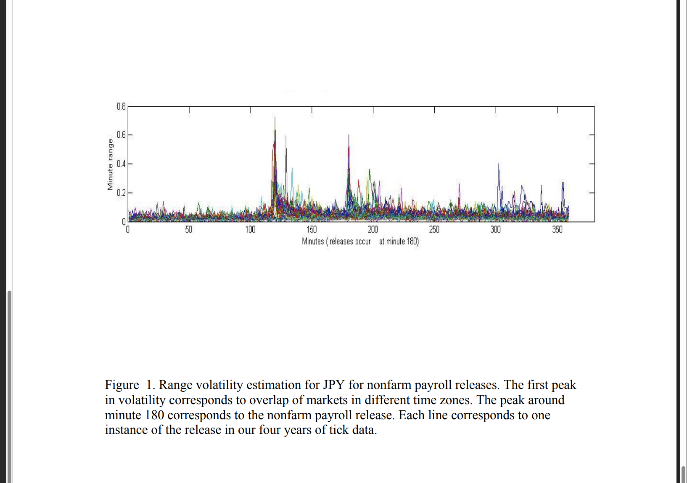

# Rezania (2010) - Figure Index

**Source PDF:** `../papers/rezania_2010_intraday_fx_releases.pdf`

## Figure Locations

| Figure | Page | Description | Key Insight |
|--------|------|-------------|-------------|
| **Figure 1** | 31 | Range volatility for JPY/NFP | Massive spike at minute 180, clear exponential decay |
| **Figure 2** | 32 | Wavelet (DB3) volatility for JPY/NFP | Smoother than range, same pattern |
| **Figure 3** | 33 | Wavelet (DB5) volatility for JPY/NFP | Higher resolution, more detail |
| **Figure 4** | 34 | 12-panel grid: volatility clusters by currency/release | NFP shows sharpest spike, JPY highest overall |
| **Figure 5** | 35 | Volatility cluster scalogram (single day) | Dense clustering post-release |
| **Figure 6** | 36 | 12-panel grid: volatility of volatility | Second derivative also spikes and decays |
| **Figure 7** | 37 | Bar charts: clusters before vs after by currency | NFP: low before, high after |
| **Figure 8** | 38 | Bar charts: EUR/JPY/GBP before vs after | NFP after > before for all currencies |

## Saved Figures

| Figure | File | Description |
|--------|------|-------------|
| Figure 1 | `rezania_2010_figure1_jpy_volatility.png` | JPY range volatility for NFP releases |



**Figure 1 Caption:** Range volatility estimation for JPY for nonfarm payroll releases. The first peak in volatility corresponds to overlap of markets in different time zones. The peak around minute 180 corresponds to the nonfarm payroll release. Each line corresponds to one instance of the release in our four years of tick data.

---

## Key Visual Findings

### 1. Volatility Spike Pattern (Figures 1-3)
- Peak volatility occurs exactly at release (minute 180)
- Exponential decay visible immediately after
- Wavelet estimator produces cleaner signal

### 2. Volatility Clusters (Figures 4-6)
- NFP produces sharpest, most concentrated spike
- Less important releases (UMich) show more erratic patterns
- Traders "wait" before important releases (low pre-release clustering)

### 3. Before vs After Comparison (Figures 7-8)
- NFP: ~1500-2000 cluster-minutes before, ~2500 after
- UMich: ~5000 before, ~3500-4000 after (opposite pattern)
- JPY shows highest volatility clustering across all releases

## Reproducing Figures

To view figures, open PDF to specified page:
```bash
evince ../papers/rezania_2010_intraday_fx_releases.pdf -p 31  # Figure 1
```
